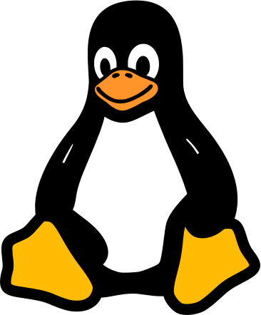
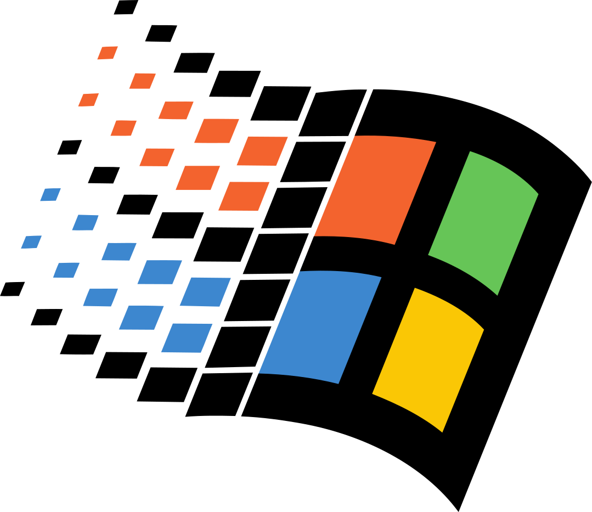

# Installation

Microfish is still in the metaphorical oven, so you're going to have to build it yourself. The good thing is that it's extremely easy to do!

Before beginning, clone the git repository for microfish and enter it:

```console
$ git clone https://github.com/weebney/microfish/ && cd microfish
```

<!-- ## Linux

Microfish is available as a pre-bundled, distribution agnostic Flatpak:

```console
$ flatpak install flathub com.weebney.Microfish.mf
```
It is also available on a handful of Linux distributions:

- Arch (AUR)

```console
$ yay -S microfish-bin
```

- NixOS

```console
$ nix-env -iA microfish-bin
```

- Fedora (RPM Fusion)

```console
$ dnf install microfish
```

## Macintosh

Click the link to download the [Microfish installer for MacOS](#). The rest should be self-explanatory.

Microfish is also available on Homebrew:

```console
$ brew install microfish
``` -->

## Building from Source (Linux & Macintosh)  

> [!NOTE] 
>
> I have never actually built Microfish on Macintosh, but it *should* work—if you run into any problems or find the documentation needs updated, please submit a pull request!
>

1. **Building Microfish from source depends on the following:**

- [go](https://golang.org/)
- [npm](https://npmjs.com)
- [upx](https://upx.github.io/) (optional)

 If you are building on Macintosh, you need to ensure that Xcode command line tools are installed. You can install them with `xcode-select --install`.

 If you are building on Linux, ensure you have the following additional dependencies installed:

- [gcc](https://gcc.gnu.org/)
- [libgtk3](https://www.gtk.org/)
- [libwebkit](https://webkitgtk.org/)

2. **Once you've acquired the necessary dependencies, install [Wails](https://wails.io/).**

```console
$ go install github.com/wailsapp/wails/v2/cmd/wails@latest
```

3. **Ensure that Wails and its dependencies are downloaded and configured properly by running:**

```console
$ wails doctor
```

4. **Now you can build Microfish by executing `build.sh`. It will automatically build for your platform/architecture.**

```console
$ ./build.sh
```

This will build an executable in `build/bin` as `mf`. It will compress the binary as well if you have [upx](https://upx.github.io/) installed.

## Building from Source on Windows 

> [!NOTE] 
>
> I have never actually built Microfish on Windows—if you run into any problems or find the documentation needs updated, please submit a pull request!
>

1. **Building Microfish from source depends on the following:**

Download & install the following before proceeding:

- [go](https://golang.org/)
- [npm](https://npmjs.com)


2. **Once you've acquired the necessary dependencies, install [Wails](https://wails.io/).**

Open the command prompt and run the following command:

```console
$ go install github.com/wailsapp/wails/v2/cmd/wails@latest
```

3. **Ensure that Wails and its dependencies are downloaded and configured properly by running:**

Now run the following command; if anything is amiss, it should let you know.

```console
$ wails doctor
```

Please do not file issues related to the above command—diagnose any problems with the [Wails documentation](https://wails.io/docs/next/gettingstarted/installation).

4. **Now you can build Microfish by executing `wails build`. It will automatically build for your platform/architecture.**

```console
$ wails build
```

This will build an executable in `build/bin`.