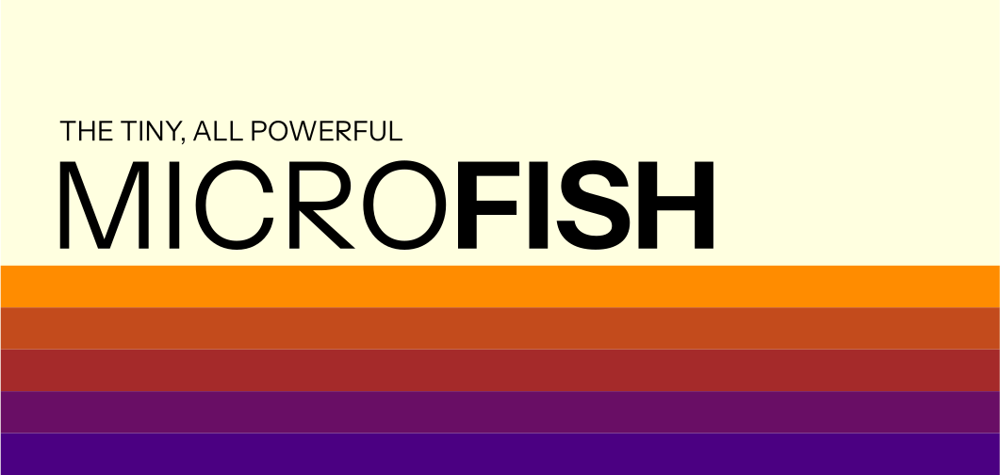
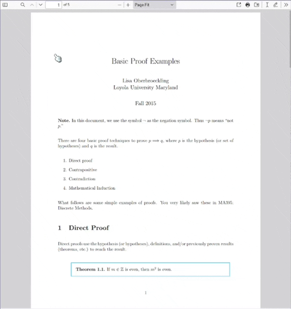
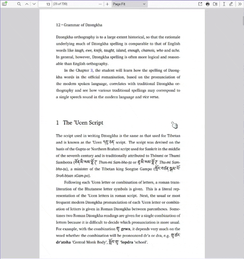
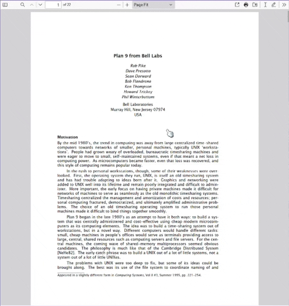

> [!IMPORTANT]  
> Microfish is in an extremely early, extremely rough state (v0.x.x). Keep this in mind until v1.x.x is released!



# Microfish PDF Reader

**Microfish rips the heart out of Firefox's PDF reader and places it into a purpose-built cybernetic exoskeleton.**

It's a sleek-and-slim standalone version of PDF.js, Firefox's PDF reader. It packages PDF.js into a 12 MB standalone program, meaning you can get the sexy, ultra-luxe PDF experience that Firefox provides but almost 10x faster. It's also got some extra goodies on top!

- Live Reloading
- Remote Documents
- Editing & Annotating
- Extremely Tiny & Perfomant
- Quick & Easy Installation
- Free and Open Source

All this and more ensures Microfish will be the last PDF reader you'll ever want to use—it takes the state-of-the-art in PDF display technology and gives it the power to be your daily document driver.

## Using Microfish

**Quick Links:**

- [Installation 💾](https://microfish.app/#aboutbottom)
- [Keyboard Shortcuts ⌨️](./docs/github/keyboardshortcuts.md)
- [Configuration 📝](#configuration)

Microfish is extremely easy to use. Open it up, open a document by pressing the , et voilà—you're ready to start reading!

<div style="text-align:center;" align="center">




</div>

## Microfish for the Technically Savvy

If you want to open a document in your home directory's _Documents_ folder, you can run:

```console
mf ~/Documents/document.pdf
```

Or, if you want to view a document from the internet:

```console
mf https://example.com/path/to/document.pdf
```

<!-- ## Configuring Microfish

Microfish is configured entirely on the command line. For example, to open Microfish in dark mode, you could run:

```console
mf document.pdf --dark
```

To make that much simpler, though, the `mf` command points to a shell script. Edit that shell script to make permanent configurations.

```console
$ cat $(which mf)
    #!/bin/bash
    exec /opt/microfish/mf --dark %F
```

This is explained in the [Configuration](./docs/github/configuration.md) article. -->

## Building Microfish

See [installation](./docs/github/installation.md) for build instructions!

<!-- To build Microfish for your platform, just execute `build.sh`

```console
./build.sh
```

This will build an executable for your system's platform in `build/bin` as `mf`.

If you want to build for multiple platforms, you can redirect a file with the desired platform names into `build.sh`. This repository provides a file to build every platform at once; just redirect `allplatforms` into `build.sh`:

```console
./build.sh < allplatforms
``` -->

## Issues and Contributing

This project follows the following philosophy:

- If this project is not helping you, then there is a bug
- If you are having a bad time using this project, then there is a bug
- If the documentation is confusing, then the documentation is buggy
- If there is a bug in this project, then we can work together to fix it.

There is a [list of known issues](https://github.com/weebney/tachyon/issues/) that are currently being worked on—if anything else comes up, though, please open an issue in the [issue tracker](https://github.com/weebney/tachyon/issues/).

### Contributing

Microfish has only a few contribution rules to keep the project's codebase growing at a sustainable rate:

- Please squash your commits before submitting a pull request.
- Large pull requests should be split into multiple smaller pull requests where possible.
- Pull requests that include changes to the `frontend/src/pdfjs` folder will not be considered unless they provide a Microfish specific patch. If you want to propose changes to PDF.js, submit them [upstream](https://github.com/mozilla/pdf.js/).

## Shoutouts

- I can't possibly give a gracious enough thanks to [Jonas Jenwald](https://github.com/Snuffleupagus), [Tim van der Meij](https://github.com/timvandermeij), [Calixte Denizet](https://github.com/calixteman), [Yury Delendik](https://github.com/yurydelendik), [Brendan Dahl](https://github.com/brendandahl), and all other contributors to [PDF.js](https://mozilla.github.io/pdf.js/) for their incredible work on the project. What a behemoth effort—enjoyed by millions daily—that is almost entirely taken for granted.
- [Siddharth Dushantha](https://github.com/sdushantha), the creator of [ff-pdf](https://github.com/sdushantha/ff-pdf), which served both as my PDF reader before writing Microfish and as the inspiration for it. This guy is a machine, by the way; he's got so many great projects.
- [Lea Anthony](https://github.com/leaanthony) and other contributors to [Wails](https://github.com/wailsapp/wails). Wails is such a complex software sandwich, but thanks to their effort it's quite satisfying to work with.
- [You](https://en.wikipedia.org/wiki/You_(Time_Person_of_the_Year)), the reader! Thank you for using, supporting, and contributing to Microfish; without you, this project would not be possible.


